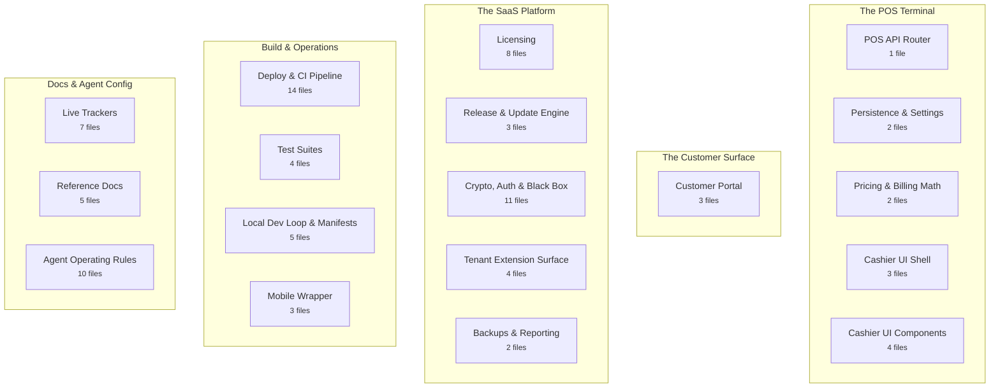
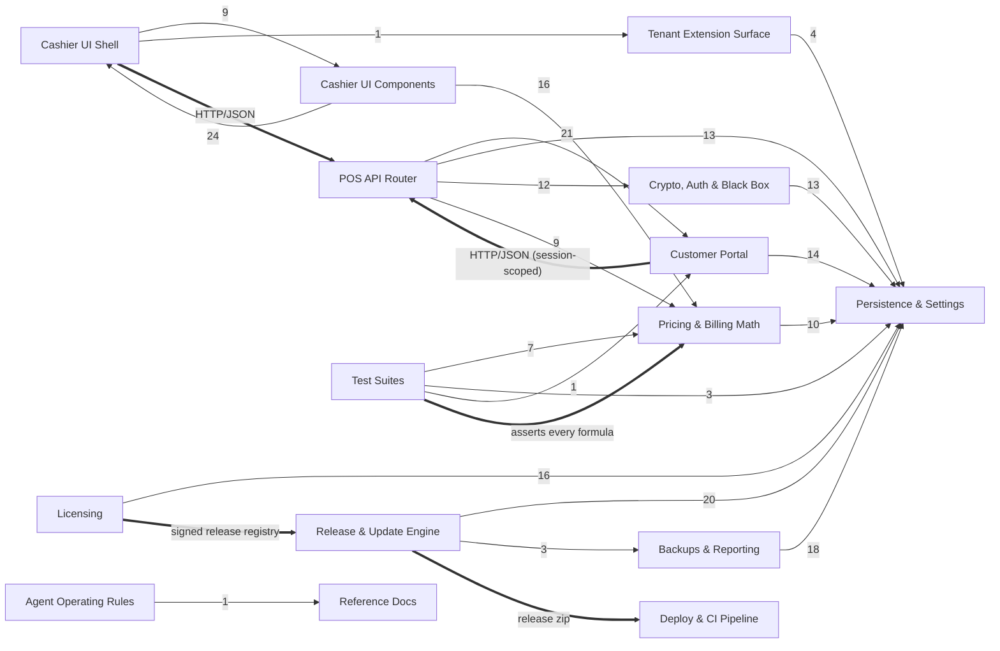

# Gold POS — Project Brain

> **This is a map. Do not read it cover to cover.** Grep it for the region, file, or symbol
> you need and read only that block. Generated by `docs/brain/build-brain.mjs` — do not edit
> this file; edit `brain.map.json` and redraw.

| | |
|---|---|
| Redrawn | 2026-08-08 |
| Files in tree | 93 |
| Regions / lobes | 18 / 5 |
| Coverage | 97.8% (2 unclaimed) |
| Symbols filed | 748 |
| Cross-region relationships | 234 |

---

## 1. The shape of it

- **The POS Terminal** — What the shop actually runs: the Express API, the JSON store, pricing math, and the cashier UI.
- **The Customer Surface** — What a customer touches: the mobile portal, its authentication, and payment collection.
- **The SaaS Platform** — Licensing, signed updates, cryptography, and the tenant extension surface. Spans both servers.
- **Build & Operations** — Packaging, deployment, CI, tests, and the local dev loop.
- **Docs & Agent Config** — The trackers, the reference docs, and the rules an agent session loads.

## 2. Region index

| Region | Lobe | Files | Symbols | Reaches |
|---|---|---:|---:|---|
| [POS API Router](#pos-api-router) | The POS Terminal | 1 | 7 | Customer Portal, Persistence & Settings, Crypto, Auth & Black Box |
| [Persistence & Settings](#persistence--settings) | The POS Terminal | 2 | 20 | — |
| [Pricing & Billing Math](#pricing--billing-math) | The POS Terminal | 2 | 15 | Persistence & Settings |
| [Cashier UI Shell](#cashier-ui-shell) | The POS Terminal | 3 | 10 | Cashier UI Components, Tenant Extension Surface |
| [Cashier UI Components](#cashier-ui-components) | The POS Terminal | 4 | 62 | Cashier UI Shell, Pricing & Billing Math |
| [Customer Portal](#customer-portal) | The Customer Surface | 3 | 41 | Persistence & Settings |
| [Licensing](#licensing) | The SaaS Platform | 8 | 55 | Persistence & Settings |
| [Release & Update Engine](#release--update-engine) | The SaaS Platform | 3 | 55 | Persistence & Settings, Backups & Reporting |
| [Crypto, Auth & Black Box](#crypto-auth--black-box) | The SaaS Platform | 11 | 45 | Persistence & Settings |
| [Tenant Extension Surface](#tenant-extension-surface) | The SaaS Platform | 4 | 22 | Persistence & Settings |
| [Backups & Reporting](#backups--reporting) | The SaaS Platform | 2 | 12 | Persistence & Settings |
| [Deploy & CI Pipeline](#deploy--ci-pipeline) | Build & Operations | 14 | 10 | — |
| [Test Suites](#test-suites) | Build & Operations | 4 | 32 | Pricing & Billing Math, Persistence & Settings, Customer Portal |
| [Local Dev Loop & Manifests](#local-dev-loop--manifests) | Build & Operations | 5 | 32 | — |
| [Mobile Wrapper](#mobile-wrapper) | Build & Operations | 3 | 17 | — |
| [Live Trackers](#live-trackers) | Docs & Agent Config | 7 | 147 | — |
| [Reference Docs](#reference-docs) | Docs & Agent Config | 5 | 62 | — |
| [Agent Operating Rules](#agent-operating-rules) | Docs & Agent Config | 10 | 104 | Reference Docs |

## 3. How the regions are wired

Solid arrows contain at least one relationship parsed straight from source; dotted arrows are
entirely inferred by name and must be confirmed with grep before you rely on one. Thick arrows
are declared by hand in `brain.map.json` — connections no call graph can see.

## 4. Pathways

A call graph can tell you that A reaches B. It cannot tell you that it happens third, or that
it must. These orderings are asserted by hand.

- **Boot:** Cashier UI Shell → POS API Router → Licensing → Persistence & Settings
   The UI boots, hits the API, which verifies the license signature and grace window before the terminal is usable.
- **A sale:** Cashier UI Components → Pricing & Billing Math → POS API Router → Persistence & Settings
   Billing desk computes with the shared math helpers, posts to the router, which writes the partitioned annual sales file.
- **A customer payment:** Customer Portal → POS API Router → Persistence & Settings → Backups & Reporting
   Portal collects, router records against the advances ledger, the backup job captures it that night.
- **An update:** Release & Update Engine → Licensing → Crypto, Auth & Black Box → Persistence & Settings
   Engine polls the registry, verifies the release signature against release_public.pem, snapshots to _rollback/, then applies.

## 5. Regions in detail

### The POS Terminal

#### POS API Router

`pos-api` · 1 file · 7 symbols

The single Express router for the shop terminal — sales, payments, analytics, settings, and every /api route the cashier UI calls. The choke point most cross-cutting fixes belong at.

Files

- `backend/server.js`

**Busiest symbols:** `server.js`, `recordAdvanceDeposit()`, `computeAdvanceLedger()`, `phoneHasStoreHistory()`, `__dirname`, `app`, `createRazorpayOrder()`

**Reaches:** Customer Portal (21) · Persistence & Settings (13) · Crypto, Auth & Black Box (12) · Pricing & Billing Math (9) · Backups & Reporting (7) · Tenant Extension Surface (4) · Licensing (4) · Release & Update Engine (4)

> **Declared link** Cashier UI Shell → POS API Router (HTTP/JSON). The browser calls the Express router over the network. No AST extractor can see this edge — it is asserted by hand.

> **Declared link** Customer Portal → POS API Router (HTTP/JSON (session-scoped)). Same network hop, but every /api/customer/* call now carries a session established by customerAuth.js.

#### Persistence & Settings

`persistence` · 2 files · 20 symbols

Atomic JSON file writers, the error/telemetry logs, and the settings default-merge-and-retire mechanism that stands in for schema migrations. Every tenant's live data passes through here.

Files

- `backend/db.js`
- `backend/defaultSettings.js`

**Busiest symbols:** `logError()`, `readJSON()`, `logTelemetry()`, `db.js`, `writeJSON()`, `defaultSettings.js`, `migrateSettings()`, `getDefaultSettings()`, `redactSettings()`, `unredactSettings()` … +10

#### Pricing & Billing Math

`pricing` · 2 files · 15 symbols

Gold rate sync, rate overrides, and the DOM-free billing helpers shared by the browser and the Node test suite. Making charges, wastage, GST, and bi-directional rounding live here.

Files

- `backend/priceEngine.js`
- `frontend/js/lib/billingMath.js`

**Busiest symbols:** `billingMath.js`, `priceEngine.js`, `round2()`, `computeInvoiceTotals()`, `normalizeTaxMode()`, `makingChargeFromPercent()`, `makingPercentFromAmount()`, `syncGoldPrice()`, `num()`, `clampMakingPercent()` … +5

**Reaches:** Persistence & Settings (10)

> **Declared link** Test Suites → Pricing & Billing Math (asserts every formula). test_billing_math.js imports frontend/js/lib/ directly — the reason frontend/package.json exists at all.

#### Cashier UI Shell

`pos-ui` · 3 files · 10 symbols

The admin single-page terminal: boot sequence, license gate, navigation controller, and the whole visual vocabulary. Vanilla JS/CSS served straight off disk.

Files

- `frontend/css/app.css`
- `frontend/index.html`
- `frontend/js/app.js`

**Busiest symbols:** `adminFetch()`, `app.js`, `logTelemetry()`, `loadFrontendExtension()`, `checkLicenseStatus()`, `initDiagnosticsDrawer()`, `initNavigation()`, `showLicenseLockOverlay()`, `showUpdateBannerIfNeeded()`, `initAdminAuth()`

**Reaches:** Cashier UI Components (9) · Tenant Extension Surface (1)

> **Declared link** Cashier UI Shell → POS API Router (HTTP/JSON). The browser calls the Express router over the network. No AST extractor can see this edge — it is asserted by hand.

#### Cashier UI Components

`pos-components` · 4 files · 62 symbols

The screens themselves — billing desk, dashboard, advances ledger, settings. The pattern any new screen should copy rather than reinvent.

Files

- `frontend/js/components/AdvancesManager.js`
- `frontend/js/components/BillingDesk.js`
- `frontend/js/components/Dashboard.js`
- `frontend/js/components/SettingsManager.js`

**Busiest symbols:** `SettingsManager`, `BillingDesk`, `.renderSection()`, `.setupEventListeners()`, `BillingDesk.js`, `Dashboard`, `AdvancesManager`, `.init()`, `.recalculate()`, `.saveSettings()` … +52

**Reaches:** Cashier UI Shell (24) · Pricing & Billing Math (16)

### The Customer Surface

#### Customer Portal

`customer-portal` · 3 files · 41 symbols

The customer-facing mobile page, its password-gated session flow, and offline UPI QR generation. Session-scoped as of Phase 20.1 — previously-public endpoints are now gated.

Files

- `backend/customerAuth.js`
- `frontend/customer.html`
- `frontend/js/qrGenerator.js`

**Busiest symbols:** `customerAuth.js`, `readAccounts()`, `loginCustomer()`, `writeAccounts()`, `createCustomerAccount()`, `createCustomerSession()`, `setCustomerPassword()`, `ensureSessionIndex()`, `destroyCustomerSession()`, `findAccount()` … +31

**Reaches:** Persistence & Settings (14)

> **Declared link** Customer Portal → POS API Router (HTTP/JSON (session-scoped)). Same network hop, but every /api/customer/* call now carries a session established by customerAuth.js.

### The SaaS Platform

#### Licensing

`licensing` · 8 files · 55 symbols

The RSA handshake that decides whether a tenant may run: the central signing service on :6060, the client-side signature verification, and the 7-day grace window.

Files

- `backend/licenseChecker.js`
- `licensing_server/.env.example`
- `licensing_server/README.md`
- `licensing_server/keys/license_public.pem`
- `licensing_server/keys/release_public.pem`
- `licensing_server/package-lock.json`
- `licensing_server/package.json`
- `licensing_server/server.js`

**Busiest symbols:** `server.js`, `licenseChecker.js`, `isLicenseValid()`, `package.json`, `syncLicenseStatus()`, `SaaS Central Licensing Server`, `checkForUpdate()`, `checkLicenseGate()`, `DatabaseAdapter`, `dependencies` … +45

**Reaches:** Persistence & Settings (16)

> **Declared link** Licensing → Release & Update Engine (signed release registry). The licensing server both signs licenses and publishes the release registry the update engine polls. Two responsibilities, one process.

#### Release & Update Engine

`updates` · 3 files · 55 symbols

Packaging a release, signing it, and the tiered auto/manual apply-and-rollback path on the tenant side. Security-channel releases apply themselves; feature and patch ones ask.

Files

- `CHANGELOG.md`
- `backend/updateEngine.js`
- `release_pipeline.js`

**Busiest symbols:** `updateEngine.js`, `applyUpdate()`, `release_pipeline.js`, `checkForUpdates()`, `Changelog`, `copyTreeExcludingProtected()`, `[1.2.0] — 2026-08-07`, `applyPendingUpdate()`, `fetchVerifiedRelease()`, `[Unreleased]` … +45

**Reaches:** Persistence & Settings (20) · Backups & Reporting (3)

> **Declared link** Licensing → Release & Update Engine (signed release registry). The licensing server both signs licenses and publishes the release registry the update engine polls. Two responsibilities, one process.

> **Declared link** Release & Update Engine → Deploy & CI Pipeline (release zip). release_pipeline.js produces the artifact the tiered engine distributes; the CI pipeline deploys the owner's own instances. Different distribution paths for the same build.

#### Crypto, Auth & Black Box

`security` · 11 files · 45 symbols

Admin authentication and lockout, the RSA-4096/AES-256-GCM diagnostics envelope, black-box incident logging, and every key material path. Nothing private here is ever committed.

Files

- `backend/.env.example`
- `backend/adminAuth.js`
- `backend/blackBoxLogger.js`
- `backend/cryptoHelper.js`
- `backend/developer_doomsday_keys/test_decrypt.js`
- `backend/keys/blackbox_public.pem`
- `backend/keys/developer_public.pem`
- `backend/keys/license_public.pem`
- `backend/keys/release_public.pem`
- `developer_blackbox_keys/analyze_blackbox.js`
- `developer_blackbox_keys/package.json`

**Busiest symbols:** `adminAuth.js`, `blackBoxLogger.js`, `cryptoHelper.js`, `analyze_blackbox.js`, `main()`, `recordLoginResult()`, `requireAdminSession()`, `encryptLevel2Payload()`, `logBlackBoxEvent()`, `loginRateLimiter()` … +35

**Reaches:** Persistence & Settings (13)

#### Tenant Extension Surface

`extensions` · 4 files · 22 symbols

The hook dispatcher and drop-in surface that lets a tenant customise behaviour without forking. Deliberately never overwritten by an update.

Files

- `backend/extensions/README.md`
- `backend/extensions/index.js`
- `docs/THIRD_PARTY_DEVELOPER_GUIDE.md`
- `frontend/js/extensions/index.js`

**Busiest symbols:** `index.js`, `Extensions — 3rd-Party Developer Contract`, `fireHook()`, `loadExtensions()`, `Working With Third-Party Developers`, `discoverExtensionFiles()`, `index.js`, `README.md`, `safeClone()`, `THIRD_PARTY_DEVELOPER_GUIDE.md` … +12

**Reaches:** Persistence & Settings (4)

#### Backups & Reporting

`maintenance` · 2 files · 12 symbols

The scheduled jobs: daily dated backups with 7-day pruning, and the emailed operational reports.

Files

- `backend/backupEngine.js`
- `backend/emailReporter.js`

**Busiest symbols:** `emailReporter.js`, `backupEngine.js`, `sendSummaryReport()`, `createBackup()`, `sendMailIfConfigured()`, `pruneOldBackups()`, `computeSummary()`, `getTransporter()`, `initBackupScheduler()`, `initReportScheduler()` … +2

**Reaches:** Persistence & Settings (18)

### Build & Operations

#### Deploy & CI Pipeline

`deploy` · 14 files · 10 symbols

The owner's internal Dev → Sandbox → Live pipeline: PM2 ecosystem files, nginx template, the SSH deploy script, and the four GitHub workflows. Live is gated on a manual approval click.

Files

- `.github/workflows/cd-dev.yml`
- `.github/workflows/cd-live.yml`
- `.github/workflows/cd-sandbox.yml`
- `.github/workflows/daily-checks.yml`
- `deploy/ecosystem.base.cjs`
- `deploy/ecosystem.config.cjs`
- `deploy/ecosystem.dev.config.cjs`
- `deploy/ecosystem.licensing-live.config.cjs`
- `deploy/ecosystem.licensing-nonprod.config.cjs`
- `deploy/ecosystem.live.config.cjs`
- `deploy/ecosystem.sandbox.config.cjs`
- `deploy/nginx.conf.template`
- `deploy/provision-pipeline.sh`
- `deploy/remote-deploy.sh`

**Busiest symbols:** `provision-pipeline.sh`, `provision-pipeline.sh script`, `log()`, `overlay_keys()`, `start_app()`, `warn()`, `DEBIAN_FRONTEND`, `gen_secret()`, `remote-deploy.sh`, `remote-deploy.sh script`

> **Declared link** Release & Update Engine → Deploy & CI Pipeline (release zip). release_pipeline.js produces the artifact the tiered engine distributes; the CI pipeline deploys the owner's own instances. Different distribution paths for the same build.

#### Test Suites

`tests` · 4 files · 32 symbols

Assert-driven, no framework: billing math assertions plus the system integration suite. Anything touching money must be covered here before it is called done.

Files

- `backend/test_billing_math.js`
- `backend/test_routes.js`
- `backend/test_suite.js`
- `test.bat`

**Busiest symbols:** `test_billing_math.js`, `test_routes.js`, `test_suite.js`, `seedDataDir()`, `startServer()`, `getFreePort()`, `sumPrintedRows()`, `testCustomerPasswordHashing()`, `__dirname`, `__dirname` … +22

**Reaches:** Pricing & Billing Math (7) · Persistence & Settings (3) · Customer Portal (1)

> **Declared link** Test Suites → Pricing & Billing Math (asserts every formula). test_billing_math.js imports frontend/js/lib/ directly — the reason frontend/package.json exists at all.

#### Local Dev Loop & Manifests

`dev-loop` · 5 files · 32 symbols

The scripts that start and restart the thing locally, plus the dependency manifests that define the budget in CLAUDE.md §0. Restart_Server.bat frees port 5000 before relaunching, which is the safe way to restart after a code change.

Files

- `.gitignore`
- `Restart_Server.bat`
- `backend/package-lock.json`
- `backend/package.json`
- `frontend/package.json`

**Busiest symbols:** `package.json`, `dependencies`, `scripts`, `package.json`, `cors`, `dotenv`, `engines`, `express`, `node-cron`, `nodemailer` … +22

#### Mobile Wrapper

`mobile` · 3 files · 17 symbols

A Capacitor shell around the same web frontend. Carries no business logic of its own and must never grow any.

Files

- `mobile/capacitor.config.json`
- `mobile/package.json`
- `mobile/www/index.html`

**Busiest symbols:** `package.json`, `scripts`, `devDependencies`, `@capacitor/android`, `@capacitor/cli`, `@capacitor/core`, `dependencies`, `@capacitor/android`, `@capacitor/cli`, `@capacitor/core` … +7

### Docs & Agent Config

#### Live Trackers

`trackers` · 7 files · 147 symbols

What is to be done and what was built. Checklists mark [x] only when verified; the ledger is index-style and points back at them.

Files

- `docs/GO_LIVE_CHECKLIST.md`
- `docs/LEDGER.md`
- `docs/PIPELINE_CHECKLIST.md`
- `docs/PRODUCTION_READINESS_ROADMAP.md`
- `docs/PROJECT_PLAN.md`
- `docs/SCHEME_MODULE_PLAN.md`
- `docs/TESTING_CHECKLIST.md`

**Busiest symbols:** `Gold POS — Manual Testing Notepad`, `5. Roadmap to SaaS-Ready Deployment (Phase 9 series — Planned)`, `4. Build checklist`, `Gold POS — Production Readiness and Future-Proof Roadmap`, `Gold Savings Scheme Module — Plan & Build Checklist (Phase 20 series)`, `5. Delivery roadmap`, `Track A — Dev/Sandbox/Live pipeline infrastructure`, `GO_LIVE_CHECKLIST.md`, `Project Plan: SaaS Gold Business POS`, `12. Customer Portal (`http://localhost:5000/customer.html`)` … +137

#### Reference Docs

`reference` · 5 files · 62 symbols

Architecture, requirements, and the handover snapshot. ai_handover.md §0 is the first and usually only thing a fresh session should read.

Files

- `deploy/README.md`
- `docs/BRD.md`
- `docs/ai_handover.md`
- `docs/archive/README.md`
- `mobile/README.md`

**Busiest symbols:** `AI Handover: Gold Business POS (SaaS Platform)`, `Deployment Runbook — Per-Tenant Cloud Instance`, `4. Operational Commands & Maintenance`, `3. Scope of Requirements`, `Business Requirements Document (BRD)`, `8. Multi-environment pipeline (Dev / Sandbox / Live) — Phase 19`, `Native Android Customer App (v1 — Capacitor Wrapper)`, `2. Core Security & Licensing Flows`, `Archive — closed history, write-once`, `2. Project Overview & Business Value` … +52

#### Agent Operating Rules

`agent-config` · 10 files · 104 symbols

The rules a session loads and the mechanism that enforces them: standing rules, the reasoning behind them, the guard hooks, the vendored skill, and this brain.

Files

- `.claude/settings.json`
- `.claude/skills/karpathy-guidelines/SKILL.md`
- `CLAUDE.md`
- `docs/CLAUDE.md`
- `docs/FOUNDATION.md`
- `docs/brain/BRAIN.md`
- `docs/brain/README.md`
- `docs/brain/brain.html`
- `docs/brain/brain.map.json`
- `docs/brain/build-brain.mjs`

**Busiest symbols:** `build-brain.mjs`, `Project operating rules — Gold POS`, `Project foundation — how this project is run`, `Gold POS — Project Brain`, `5. Regions in detail`, `Karpathy Guidelines`, `The POS Terminal`, `The Project Brain`, `The SaaS Platform`, `Adding to it` … +94

**Reaches:** Reference Docs (1)

## 6. What the brain does not know yet

2 file(s) are claimed by no region. Add a pattern to whichever region owns them:

- `docs/archive/checklist_closed_phases.md`
- `docs/archive/ledger_closed_phases.md`

Also invisible here, structurally:

- **Anything graphify has no extractor for** — `.md`, `.yml`, `.bat`, `.sh`, `.pem`, `.json`. Those
  files are filed into regions by path and counted, but contribute no symbols and no edges. A
  region can be substantial and show few symbols for exactly this reason.
- **Runtime dispatch** — anything reached through a registry, an event name, or a table lookup
  rather than a direct call. Where it matters, it is written down as a declared link.
