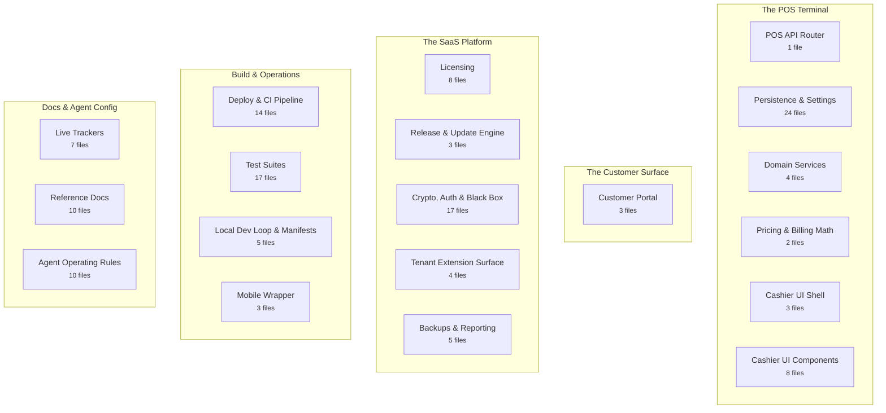
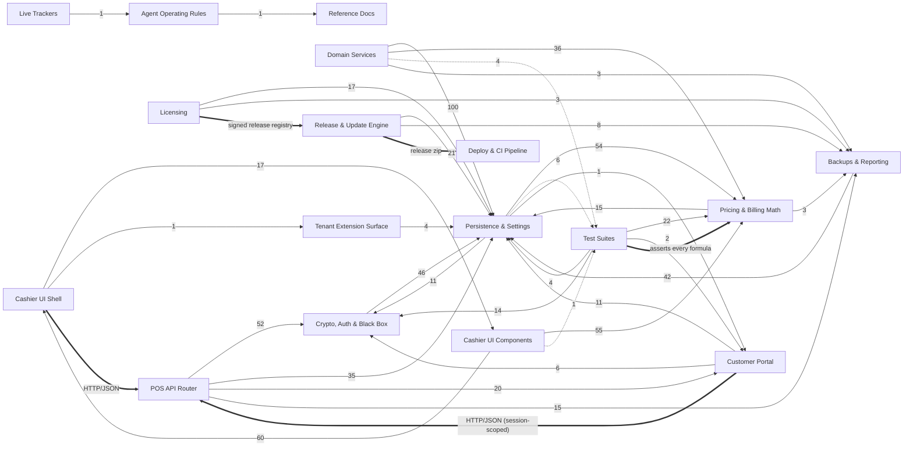

# Gold POS — Project Brain

> **This is a map. Do not read it cover to cover.** Grep it for the region, file, or symbol
> you need and read only that block. Generated by `docs/brain/build-brain.mjs` — do not edit
> this file; edit `brain.map.json` and redraw.

| | |
|---|---|
| Redrawn | 2026-08-19 |
| Files in tree | 148 |
| Regions / lobes | 19 / 5 |
| Coverage | 100.0% (0 unclaimed) |
| Symbols filed | 1532 |
| Cross-region relationships | 722 |

---

## 1. The shape of it

- **The POS Terminal** — What the shop actually runs: the Express API, the JSON store, pricing math, and the cashier UI.
- **The Customer Surface** — What a customer touches: the mobile portal, its authentication, and payment collection.
- **The SaaS Platform** — Licensing, signed updates, cryptography, and the tenant extension surface. Spans both servers.
- **Build & Operations** — Packaging, deployment, CI, tests, and the local dev loop.
- **Docs & Agent Config** — The trackers, the reference docs, and the rules an agent session loads.

## 2. Region index

| Region | Lobe | Files | Symbols | Reaches |
|---|---|---:|---:|---|
| [POS API Router](#pos-api-router) | The POS Terminal | 1 | 45 | Crypto, Auth & Black Box, Persistence & Settings, Customer Portal |
| [Persistence & Settings](#persistence--settings) | The POS Terminal | 24 | 273 | Pricing & Billing Math, Crypto, Auth & Black Box, Test Suites |
| [Domain Services](#domain-services) | The POS Terminal | 4 | 41 | Persistence & Settings, Pricing & Billing Math, Test Suites |
| [Pricing & Billing Math](#pricing--billing-math) | The POS Terminal | 2 | 33 | Persistence & Settings, Backups & Reporting |
| [Cashier UI Shell](#cashier-ui-shell) | The POS Terminal | 3 | 17 | Cashier UI Components, Tenant Extension Surface |
| [Cashier UI Components](#cashier-ui-components) | The POS Terminal | 8 | 143 | Cashier UI Shell, Pricing & Billing Math, Test Suites |
| [Customer Portal](#customer-portal) | The Customer Surface | 3 | 39 | Persistence & Settings, Crypto, Auth & Black Box |
| [Licensing](#licensing) | The SaaS Platform | 8 | 55 | Persistence & Settings, Backups & Reporting |
| [Release & Update Engine](#release--update-engine) | The SaaS Platform | 3 | 56 | Persistence & Settings, Backups & Reporting |
| [Crypto, Auth & Black Box](#crypto-auth--black-box) | The SaaS Platform | 17 | 118 | Persistence & Settings |
| [Tenant Extension Surface](#tenant-extension-surface) | The SaaS Platform | 4 | 22 | Persistence & Settings |
| [Backups & Reporting](#backups--reporting) | The SaaS Platform | 5 | 44 | Persistence & Settings |
| [Deploy & CI Pipeline](#deploy--ci-pipeline) | Build & Operations | 14 | 12 | — |
| [Test Suites](#test-suites) | Build & Operations | 17 | 152 | Pricing & Billing Math, Crypto, Auth & Black Box, Persistence & Settings |
| [Local Dev Loop & Manifests](#local-dev-loop--manifests) | Build & Operations | 5 | 55 | — |
| [Mobile Wrapper](#mobile-wrapper) | Build & Operations | 3 | 17 | — |
| [Live Trackers](#live-trackers) | Docs & Agent Config | 7 | 184 | Agent Operating Rules |
| [Reference Docs](#reference-docs) | Docs & Agent Config | 10 | 121 | — |
| [Agent Operating Rules](#agent-operating-rules) | Docs & Agent Config | 10 | 105 | Reference Docs |

## 3. How the regions are wired

Solid arrows contain at least one relationship parsed straight from source; dotted arrows are
entirely inferred by name and must be confirmed with grep before you rely on one. Thick arrows
are declared by hand in `brain.map.json` — connections no call graph can see.

## 4. Pathways

A call graph can tell you that A reaches B. It cannot tell you that it happens third, or that
it must. These orderings are asserted by hand.

- **Boot:** Cashier UI Shell → POS API Router → Licensing → Persistence & Settings
   The UI boots, hits the API, which verifies the license signature and grace window before the terminal is usable.
- **A sale:** Cashier UI Components → Pricing & Billing Math → POS API Router → Persistence & Settings
   Billing desk computes with the shared math helpers, posts to the router, which writes the partitioned annual sales file.
- **A customer payment:** Customer Portal → POS API Router → Persistence & Settings → Backups & Reporting
   Portal collects, router records against the advances ledger, the backup job captures it that night.
- **An update:** Release & Update Engine → Licensing → Crypto, Auth & Black Box → Persistence & Settings
   Engine polls the registry, verifies the release signature against release_public.pem, snapshots to _rollback/, then applies.

## 5. Regions in detail

### The POS Terminal

#### POS API Router

`pos-api` · 1 file · 45 symbols

The single Express router for the shop terminal — sales, payments, analytics, settings, and every /api route the cashier UI calls. The choke point most cross-cutting fixes belong at.

Files

- `backend/server.js`

**Busiest symbols:** `server.js`, `bootstrapServer()`, `initialiseLedger()`, `cookieOpts()`, `billingSettings()`, `collectLegacySource()`, `shutdown()`, `startServer()`, `clearAdminSessionCookies()`, `clearCustomerSessionCookies()` … +35

**Reaches:** Crypto, Auth & Black Box (52) · Persistence & Settings (35) · Customer Portal (20) · Backups & Reporting (15) · Pricing & Billing Math (11) · Tenant Extension Surface (5) · Licensing (5) · Release & Update Engine (5) · Domain Services (4)

> **Declared link** Cashier UI Shell → POS API Router (HTTP/JSON). The browser calls the Express router over the network. No AST extractor can see this edge — it is asserted by hand.

> **Declared link** Customer Portal → POS API Router (HTTP/JSON (session-scoped)). Same network hop, but every /api/customer/* call now carries a session established by customerAuth.js.

#### Persistence & Settings

`persistence` · 24 files · 273 symbols

The SQLite datastore and the JSON layer it replaces. backend/repositories/ is the ADR-001 seam: connection/PRAGMAs, the migration runner, the numbered migrations, and one repository per domain — no SQL string exists above this directory, which is what keeps the documented move to PostgreSQL a swap rather than a rewrite. importLegacyJson.js carries a live tenant across from the JSON ledger with a dry run, a reconciliation report and a rollback. db.js/defaultSettings.js are the legacy JSON writers plus the settings default-merge-and-retire mechanism; settings and licence stay JSON on purpose. seed.js generates the deterministic synthetic fixture database.

Files

- `backend/db.js`
- `backend/defaultSettings.js`
- `backend/importLegacyJson.js`
- `backend/repositories/advanceRepository.js`
- `backend/repositories/auditRepository.js`
- `backend/repositories/calendar.js`
- `backend/repositories/connection.js`
- `backend/repositories/creditNoteRepository.js`
- `backend/repositories/customerRepository.js`
- `backend/repositories/index.js`
- `backend/repositories/invoiceRepository.js`
- `backend/repositories/migrate.js`
- `backend/repositories/migrations/001_initial_schema.sql`
- `backend/repositories/migrations/002_credit_note_projection.sql`
- `backend/repositories/migrations/003_reference_reuse_after_rejection.sql`
- `backend/repositories/migrations/004_multi_line_invoice_fidelity.sql`
- `backend/repositories/migrations/005_audit_hash_chain.sql`
- `backend/repositories/organisationRepository.js`
- `backend/repositories/paymentRepository.js`
- `backend/repositories/rateRepository.js`
- `backend/repositories/sequenceRepository.js`
- `backend/repositories/userRepository.js`
- `backend/seed.js`
- `backend/settingsStore.js`

**Busiest symbols:** `getDb()`, `logError()`, `index.js`, `db.js`, `logTelemetry()`, `importLegacyJson.js`, `advanceRepository.js`, `newId()`, `invoiceRepository.js`, `creditNoteRepository.js` … +263

**Reaches:** Pricing & Billing Math (54) · Crypto, Auth & Black Box (11) · Test Suites (6, inferred only) · Customer Portal (1) · Backups & Reporting (1, inferred only)

#### Domain Services

`domain-services` · 4 files · 41 symbols

The money rules, sitting between the routes and the repositories. A sale is one ACID transaction here — number allocation, header, lines, tenders, advance redemption and audit commit together or not at all — and the advance-balance check runs inside it, which is what stops two tills spending one balance. Services own the pricing decision and the persistence; routes own only HTTP parsing and status codes.

Files

- `backend/services/advanceService.js`
- `backend/services/paymentService.js`
- `backend/services/returnService.js`
- `backend/services/saleService.js`

**Busiest symbols:** `saleService.js`, `returnService.js`, `paymentService.js`, `advanceService.js`, `createSale()`, `createReturn()`, `creditCapturedPayment()`, `recordDeposit()`, `isUniqueViolation()`, `priceLine()` … +31

**Reaches:** Persistence & Settings (100) · Pricing & Billing Math (36) · Test Suites (4, inferred only) · Backups & Reporting (3)

#### Pricing & Billing Math

`pricing` · 2 files · 33 symbols

Gold rate sync, rate overrides, and the DOM-free billing helpers shared by the browser and the Node test suite. Making charges, GST, bi-directional rounding, the per-line allocation that makes a multi-line invoice's rows sum to its total, the saleLines() seam that reads a stored sale of either shape, and the return-refund pipeline all live here. Wastage does NOT — it exists nowhere in the tree; see the roadmap Phase 5 note.

Files

- `backend/priceEngine.js`
- `frontend/js/lib/billingMath.js`

**Busiest symbols:** `billingMath.js`, `round2()`, `fromPaise()`, `toPaise()`, `round3()`, `computeReturnRefund()`, `num()`, `priceEngine.js`, `normalizeTaxMode()`, `computeInvoiceTotals()` … +23

**Reaches:** Persistence & Settings (15) · Backups & Reporting (3)

> **Declared link** Test Suites → Pricing & Billing Math (asserts every formula). test_billing_math.js imports frontend/js/lib/ directly — the reason frontend/package.json exists at all.

#### Cashier UI Shell

`pos-ui` · 3 files · 17 symbols

The admin single-page terminal: boot sequence, license gate, navigation controller, and the whole visual vocabulary. Vanilla JS/CSS served straight off disk.

Files

- `frontend/css/app.css`
- `frontend/index.html`
- `frontend/js/app.js`

**Busiest symbols:** `adminFetch()`, `app.js`, `logTelemetry()`, `initAdminAuth()`, `loadFrontendExtension()`, `canApprove()`, `getActor()`, `loadActor()`, `setActor()`, `checkLicenseStatus()` … +7

**Reaches:** Cashier UI Components (17) · Tenant Extension Surface (1)

> **Declared link** Cashier UI Shell → POS API Router (HTTP/JSON). The browser calls the Express router over the network. No AST extractor can see this edge — it is asserted by hand.

#### Cashier UI Components

`pos-components` · 8 files · 143 symbols

The screens themselves — billing desk, dashboard, advances ledger, settings. The pattern any new screen should copy rather than reinvent.

Files

- `frontend/js/components/AdvancesManager.js`
- `frontend/js/components/AuditTrail.js`
- `frontend/js/components/BillingDesk.js`
- `frontend/js/components/CustomerAccountsManager.js`
- `frontend/js/components/Dashboard.js`
- `frontend/js/components/ReprintDesk.js`
- `frontend/js/components/ReturnDesk.js`
- `frontend/js/components/SettingsManager.js`

**Busiest symbols:** `SettingsManager`, `BillingDesk`, `ReturnDesk`, `BillingDesk.js`, `.renderSection()`, `.setupEventListeners()`, `ReturnDesk.js`, `ReprintDesk.js`, `.fileReturn()`, `.openReturnForm()` … +133

**Reaches:** Cashier UI Shell (60) · Pricing & Billing Math (55) · Test Suites (1, inferred only)

### The Customer Surface

#### Customer Portal

`customer-portal` · 3 files · 39 symbols

The customer-facing mobile page, its password-gated session flow, and offline UPI QR generation. Session-scoped as of Phase 20.1 — previously-public endpoints are now gated.

Files

- `backend/customerAuth.js`
- `frontend/customer.html`
- `frontend/js/qrGenerator.js`

**Busiest symbols:** `customerAuth.js`, `loginCustomer()`, `readAccounts()`, `requireCustomerSession()`, `writeAccounts()`, `createCustomerAccount()`, `createCustomerSession()`, `setCustomerPassword()`, `ensureSessionIndex()`, `destroyCustomerSession()` … +29

**Reaches:** Persistence & Settings (11) · Crypto, Auth & Black Box (6)

> **Declared link** Customer Portal → POS API Router (HTTP/JSON (session-scoped)). Same network hop, but every /api/customer/* call now carries a session established by customerAuth.js.

### The SaaS Platform

#### Licensing

`licensing` · 8 files · 55 symbols

The RSA handshake that decides whether a tenant may run: the central signing service on :6060, the client-side signature verification, and the 7-day grace window.

Files

- `backend/licenseChecker.js`
- `licensing_server/.env.example`
- `licensing_server/README.md`
- `licensing_server/keys/license_public.pem`
- `licensing_server/keys/release_public.pem`
- `licensing_server/package-lock.json`
- `licensing_server/package.json`
- `licensing_server/server.js`

**Busiest symbols:** `server.js`, `licenseChecker.js`, `syncLicenseStatus()`, `isLicenseValid()`, `package.json`, `SaaS Central Licensing Server`, `checkForUpdate()`, `checkLicenseGate()`, `DatabaseAdapter`, `dependencies` … +45

**Reaches:** Persistence & Settings (17) · Backups & Reporting (3)

> **Declared link** Licensing → Release & Update Engine (signed release registry). The licensing server both signs licenses and publishes the release registry the update engine polls. Two responsibilities, one process.

#### Release & Update Engine

`updates` · 3 files · 56 symbols

Packaging a release, signing it, and the tiered auto/manual apply-and-rollback path on the tenant side. Security-channel releases apply themselves; feature and patch ones ask.

Files

- `CHANGELOG.md`
- `backend/updateEngine.js`
- `release_pipeline.js`

**Busiest symbols:** `updateEngine.js`, `applyUpdate()`, `release_pipeline.js`, `checkForUpdates()`, `Changelog`, `copyTreeExcludingProtected()`, `fetchVerifiedRelease()`, `[1.2.0] — 2026-08-07`, `[Unreleased]`, `applyPendingUpdate()` … +46

**Reaches:** Persistence & Settings (21) · Backups & Reporting (8)

> **Declared link** Licensing → Release & Update Engine (signed release registry). The licensing server both signs licenses and publishes the release registry the update engine polls. Two responsibilities, one process.

> **Declared link** Release & Update Engine → Deploy & CI Pipeline (release zip). release_pipeline.js produces the artifact the tiered engine distributes; the CI pipeline deploys the owner's own instances. Different distribution paths for the same build.

#### Crypto, Auth & Black Box

`security` · 17 files · 118 symbols

Admin identity and every credential the terminal verifies. adminAuth.js owns the lot: scrypt-hashed PINs (one tenant-wide authSalt, because a PIN-only login has no username to look a per-user salt up by), the migration that converts a tenant's plaintext PINs on boot and deletes them, the named-operator roster and its four roles, session issue/expiry/revocation, the approver and privileged-MFA gates, and RFC 6238 TOTP with single-use hashed recovery codes — all on node:crypto, no dependency. Also the RSA-4096/AES-256-GCM diagnostics envelope, black-box incident logging, the fail-closed production guard, and every key material path. Nothing private here is ever committed, and no credential may live in DEFAULT_SETTINGS — see CLAUDE.md §0. The two request-boundary modules live here too: rateLimit.js holds the one bounded keyed counter every attempt tracker and abuse limiter shares, validation.js holds the runtime shape checker that both request bodies and validateSettingsPatch() run through, and cookies.js is the hand-rolled Cookie parse/serialise behind the HttpOnly session transport and its double-submit CSRF pair.

Files

- `backend/.env.example`
- `backend/adminAuth.js`
- `backend/blackBoxLogger.js`
- `backend/cookies.js`
- `backend/cryptoHelper.js`
- `backend/developer_doomsday_keys/test_decrypt.js`
- `backend/keys/blackbox_public.pem`
- `backend/keys/developer_public.pem`
- `backend/keys/license_public.pem`
- `backend/keys/release_public.pem`
- `backend/productionGuard.js`
- `backend/rateLimit.js`
- `backend/rotateSecretKey.js`
- `backend/secretVault.js`
- `backend/validation.js`
- `developer_blackbox_keys/analyze_blackbox.js`
- `developer_blackbox_keys/package.json`

**Busiest symbols:** `adminAuth.js`, `rotateSecretKey.js`, `secretVault.js`, `productionGuard.js`, `blackBoxLogger.js`, `cryptoHelper.js`, `resolveKey()`, `validation.js`, `migrateStoredPins()`, `openSettings()` … +108

**Reaches:** Persistence & Settings (46)

#### Tenant Extension Surface

`extensions` · 4 files · 22 symbols

The hook dispatcher and drop-in surface that lets a tenant customise behaviour without forking. Deliberately never overwritten by an update.

Files

- `backend/extensions/README.md`
- `backend/extensions/index.js`
- `docs/THIRD_PARTY_DEVELOPER_GUIDE.md`
- `frontend/js/extensions/index.js`

**Busiest symbols:** `index.js`, `Extensions — 3rd-Party Developer Contract`, `fireHook()`, `loadExtensions()`, `Working With Third-Party Developers`, `discoverExtensionFiles()`, `index.js`, `README.md`, `safeClone()`, `THIRD_PARTY_DEVELOPER_GUIDE.md` … +12

**Reaches:** Persistence & Settings (4)

#### Backups & Reporting

`maintenance` · 5 files · 44 symbols

The scheduled jobs: daily dated backups with 7-day pruning, the emailed operational reports, and operational alerting (payment/webhook failures, ledger drift, backup/rate/disk/TLS/control-plane signals) through the one raiseAlert() choke point.

Files

- `backend/alerting.js`
- `backend/backupEngine.js`
- `backend/emailReporter.js`
- `backend/verifyAuditChain.js`
- `backend/verifyBackup.js`

**Busiest symbols:** `alerting.js`, `raiseAlert()`, `backupEngine.js`, `emailReporter.js`, `createBackup()`, `verifyBackup.js`, `initAlertScheduler()`, `sendSummaryReport()`, `sendMailIfConfigured()`, `checkTlsExpiry()` … +34

**Reaches:** Persistence & Settings (42)

### Build & Operations

#### Deploy & CI Pipeline

`deploy` · 14 files · 12 symbols

The owner's internal Dev → Sandbox → Live pipeline: PM2 ecosystem files, nginx template, the SSH deploy script, and the four GitHub workflows. Live is gated on a manual approval click.

Files

- `.github/workflows/cd-dev.yml`
- `.github/workflows/cd-live.yml`
- `.github/workflows/cd-sandbox.yml`
- `.github/workflows/daily-checks.yml`
- `deploy/ecosystem.base.cjs`
- `deploy/ecosystem.config.cjs`
- `deploy/ecosystem.dev.config.cjs`
- `deploy/ecosystem.licensing-live.config.cjs`
- `deploy/ecosystem.licensing-nonprod.config.cjs`
- `deploy/ecosystem.live.config.cjs`
- `deploy/ecosystem.sandbox.config.cjs`
- `deploy/nginx.conf.template`
- `deploy/provision-pipeline.sh`
- `deploy/remote-deploy.sh`

**Busiest symbols:** `provision-pipeline.sh`, `provision-pipeline.sh script`, `log()`, `overlay_keys()`, `start_app()`, `warn()`, `die()`, `DEBIAN_FRONTEND`, `gen_secret()`, `node_major()` … +2

> **Declared link** Release & Update Engine → Deploy & CI Pipeline (release zip). release_pipeline.js produces the artifact the tiered engine distributes; the CI pipeline deploys the owner's own instances. Different distribution paths for the same build.

#### Test Suites

`tests` · 17 files · 152 symbols

Assert-driven, no framework: billing math, helper integration, HTTP routes/auth, the money paths and Razorpay webhook, and the fail-closed production startup guard — all five run by npm test against temp data dirs, never backend/data/. Playwright end-to-end journeys live under tests/e2e/ and run separately (npm run test:e2e) because they need a browser binary. Anything touching money must be covered here before it is called done.

Files

- `backend/playwright.config.js`
- `backend/test_alerting.js`
- `backend/test_billing_math.js`
- `backend/test_concurrency.js`
- `backend/test_http.js`
- `backend/test_production_guard.js`
- `backend/test_repositories.js`
- `backend/test_routes.js`
- `backend/test_schema.js`
- `backend/test_suite.js`
- `backend/tests/e2e/cashier-billing.spec.js`
- `backend/tests/e2e/customer-portal.spec.js`
- `backend/tests/e2e/fixtures.js`
- `backend/tests/e2e/readLedger.mjs`
- `backend/tests/e2e/reprint-desk.spec.js`
- `backend/tests/e2e/return-desk.spec.js`
- `test.bat`

**Busiest symbols:** `test_billing_math.js`, `test_http.js`, `test_routes.js`, `test_repositories.js`, `test_suite.js`, `fixtures.js`, `row()`, `test_concurrency.js`, `return-desk.spec.js`, `test_schema.js` … +142

**Reaches:** Pricing & Billing Math (22) · Crypto, Auth & Black Box (14) · Persistence & Settings (4) · Customer Portal (2)

> **Declared link** Test Suites → Pricing & Billing Math (asserts every formula). test_billing_math.js imports frontend/js/lib/ directly — the reason frontend/package.json exists at all.

#### Local Dev Loop & Manifests

`dev-loop` · 5 files · 55 symbols

The scripts that start and restart the thing locally, plus the dependency manifests that define the budget in CLAUDE.md §0. Restart_Server.bat frees port 5000 before relaunching, which is the safe way to restart after a code change.

Files

- `.gitignore`
- `Restart_Server.bat`
- `backend/package-lock.json`
- `backend/package.json`
- `frontend/package.json`

**Busiest symbols:** `scripts`, `package.json`, `dependencies`, `package.json`, `@playwright/test`, `cors`, `devDependencies`, `dotenv`, `engines`, `express` … +45

#### Mobile Wrapper

`mobile` · 3 files · 17 symbols

A Capacitor shell around the same web frontend. Carries no business logic of its own and must never grow any.

Files

- `mobile/capacitor.config.json`
- `mobile/package.json`
- `mobile/www/index.html`

**Busiest symbols:** `package.json`, `scripts`, `devDependencies`, `@capacitor/android`, `@capacitor/cli`, `@capacitor/core`, `dependencies`, `@capacitor/android`, `@capacitor/cli`, `@capacitor/core` … +7

### Docs & Agent Config

#### Live Trackers

`trackers` · 7 files · 184 symbols

What is to be done and what was built. Checklists mark [x] only when verified; the ledger is index-style and points back at them.

Files

- `docs/GO_LIVE_CHECKLIST.md`
- `docs/LEDGER.md`
- `docs/PIPELINE_CHECKLIST.md`
- `docs/PRODUCTION_READINESS_ROADMAP.md`
- `docs/PROJECT_PLAN.md`
- `docs/SCHEME_MODULE_PLAN.md`
- `docs/TESTING_CHECKLIST.md`

**Busiest symbols:** `Gold POS — Manual Testing Notepad`, `Gold POS — Production Readiness and Future-Proof Roadmap`, `5. Roadmap to SaaS-Ready Deployment (Phase 9 series — Planned)`, `4. Build checklist`, `Gold Savings Scheme Module — Plan & Build Checklist (Phase 20 series)`, `5. Delivery roadmap`, `Track A — Dev/Sandbox/Live pipeline infrastructure`, `12. Customer Portal (`http://localhost:5000/customer.html`)`, `GO_LIVE_CHECKLIST.md`, `Project Plan: SaaS Gold Business POS` … +174

**Reaches:** Agent Operating Rules (1)

#### Reference Docs

`reference` · 10 files · 121 symbols

Architecture, requirements, and the handover snapshot. ai_handover.md §0 is the first and usually only thing a fresh session should read.

Files

- `deploy/README.md`
- `docs/AUDIT_AND_PII.md`
- `docs/BRD.md`
- `docs/RUNBOOKS.md`
- `docs/adr/ADR-001-transactional-datastore.md`
- `docs/ai_handover.md`
- `docs/archive/README.md`
- `docs/archive/checklist_closed_phases.md`
- `docs/archive/ledger_closed_phases.md`
- `mobile/README.md`

**Busiest symbols:** `Runbooks — Gold POS`, `Former §6 — Completion Checklist, closed Phases 1–18`, `Deployment Runbook — Per-Tenant Cloud Instance`, `AI Handover: Gold Business POS (SaaS Platform)`, `4. Operational Commands & Maintenance`, `Audit trail and personal data — classification and handling`, `3. Scope of Requirements`, `8. Multi-environment pipeline (Dev / Sandbox / Live) — Phase 19`, `Business Requirements Document (BRD)`, `ADR-001 — Transactional datastore for the financial ledger` … +111

#### Agent Operating Rules

`agent-config` · 10 files · 105 symbols

The rules a session loads and the mechanism that enforces them: standing rules, the reasoning behind them, the guard hooks, the vendored skill, and this brain.

Files

- `.claude/settings.json`
- `.claude/skills/karpathy-guidelines/SKILL.md`
- `CLAUDE.md`
- `docs/CLAUDE.md`
- `docs/FOUNDATION.md`
- `docs/brain/BRAIN.md`
- `docs/brain/README.md`
- `docs/brain/brain.html`
- `docs/brain/brain.map.json`
- `docs/brain/build-brain.mjs`

**Busiest symbols:** `build-brain.mjs`, `Project operating rules — Gold POS`, `Project foundation — how this project is run`, `Gold POS — Project Brain`, `The POS Terminal`, `5. Regions in detail`, `Karpathy Guidelines`, `The Project Brain`, `The SaaS Platform`, `Adding to it` … +95

**Reaches:** Reference Docs (1)

## 6. What the brain does not know yet

Every file in the working tree is claimed by a region.

Also invisible here, structurally:

- **Anything graphify has no extractor for** — `.md`, `.yml`, `.bat`, `.sh`, `.pem`, `.json`. Those
  files are filed into regions by path and counted, but contribute no symbols and no edges. A
  region can be substantial and show few symbols for exactly this reason.
- **Runtime dispatch** — anything reached through a registry, an event name, or a table lookup
  rather than a direct call. Where it matters, it is written down as a declared link.
