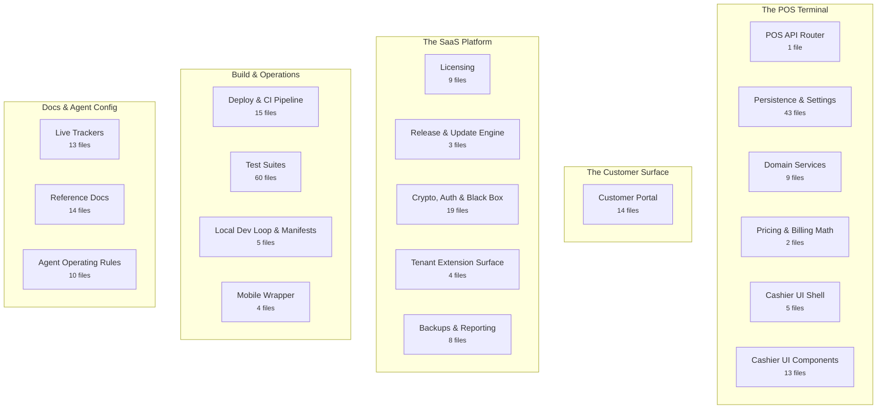
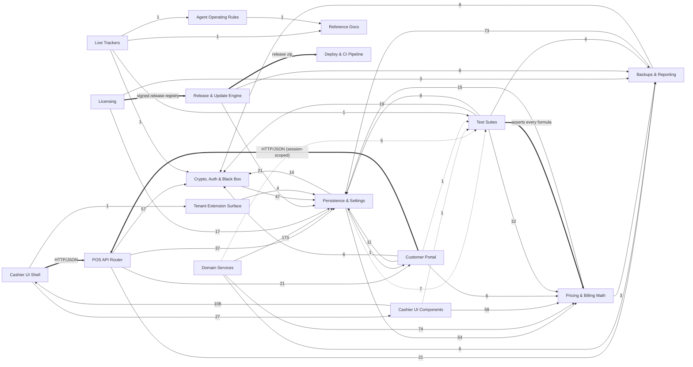

# Gold POS — Project Brain

> **This is a map. Do not read it cover to cover.** Grep it for the region, file, or symbol
> you need and read only that block. Generated by `docs/brain/build-brain.mjs` — do not edit
> this file; edit `brain.map.json` and redraw.

| | |
|---|---|
| Redrawn | 2026-09-26 |
| Files in tree | 251 |
| Regions / lobes | 19 / 5 |
| Coverage | 100.0% (0 unclaimed) |
| Symbols filed | 2213 |
| Cross-region relationships | 1008 |

---

## 1. The shape of it

```mermaid
flowchart TB
  subgraph pos["The POS Terminal"]
    direction LR
    pos_api["POS API Router<br/><small>1 file</small>"]
    persistence["Persistence & Settings<br/><small>43 files</small>"]
    domain_services["Domain Services<br/><small>9 files</small>"]
    pricing["Pricing & Billing Math<br/><small>2 files</small>"]
    pos_ui["Cashier UI Shell<br/><small>5 files</small>"]
    pos_components["Cashier UI Components<br/><small>13 files</small>"]
  end
  subgraph customer["The Customer Surface"]
    direction LR
    customer_portal["Customer Portal<br/><small>14 files</small>"]
  end
  subgraph platform["The SaaS Platform"]
    direction LR
    licensing["Licensing<br/><small>9 files</small>"]
    updates["Release & Update Engine<br/><small>3 files</small>"]
    security["Crypto, Auth & Black Box<br/><small>19 files</small>"]
    extensions["Tenant Extension Surface<br/><small>4 files</small>"]
    maintenance["Backups & Reporting<br/><small>8 files</small>"]
  end
  subgraph ops["Build & Operations"]
    direction LR
    deploy["Deploy & CI Pipeline<br/><small>15 files</small>"]
    tests["Test Suites<br/><small>60 files</small>"]
    dev_loop["Local Dev Loop & Manifests<br/><small>5 files</small>"]
    mobile["Mobile Wrapper<br/><small>4 files</small>"]
  end
  subgraph knowledge["Docs & Agent Config"]
    direction LR
    trackers["Live Trackers<br/><small>13 files</small>"]
    reference["Reference Docs<br/><small>14 files</small>"]
    agent_config["Agent Operating Rules<br/><small>10 files</small>"]
  end
```

- **The POS Terminal** — What the shop actually runs: the Express API, the JSON store, pricing math, and the cashier UI.
- **The Customer Surface** — What a customer touches: the mobile portal, its authentication, and payment collection.
- **The SaaS Platform** — Licensing, signed updates, cryptography, and the tenant extension surface. Spans both servers.
- **Build & Operations** — Packaging, deployment, CI, tests, and the local dev loop.
- **Docs & Agent Config** — The trackers, the reference docs, and the rules an agent session loads.

## 2. Region index

| Region | Lobe | Files | Symbols | Reaches |
|---|---|---:|---:|---|
| [POS API Router](#pos-api-router) | The POS Terminal | 1 | 77 | Crypto, Auth & Black Box, Persistence & Settings, Backups & Reporting |
| [Persistence & Settings](#persistence--settings) | The POS Terminal | 43 | 355 | Pricing & Billing Math, Crypto, Auth & Black Box, Test Suites |
| [Domain Services](#domain-services) | The POS Terminal | 9 | 71 | Persistence & Settings, Pricing & Billing Math, Backups & Reporting |
| [Pricing & Billing Math](#pricing--billing-math) | The POS Terminal | 2 | 37 | Persistence & Settings, Backups & Reporting |
| [Cashier UI Shell](#cashier-ui-shell) | The POS Terminal | 5 | 19 | Cashier UI Components, Tenant Extension Surface |
| [Cashier UI Components](#cashier-ui-components) | The POS Terminal | 13 | 233 | Cashier UI Shell, Pricing & Billing Math, Test Suites |
| [Customer Portal](#customer-portal) | The Customer Surface | 14 | 80 | Persistence & Settings, Crypto, Auth & Black Box, Pricing & Billing Math |
| [Licensing](#licensing) | The SaaS Platform | 9 | 70 | Persistence & Settings, Backups & Reporting |
| [Release & Update Engine](#release--update-engine) | The SaaS Platform | 3 | 57 | Persistence & Settings, Backups & Reporting |
| [Crypto, Auth & Black Box](#crypto-auth--black-box) | The SaaS Platform | 19 | 146 | Persistence & Settings |
| [Tenant Extension Surface](#tenant-extension-surface) | The SaaS Platform | 4 | 22 | Persistence & Settings |
| [Backups & Reporting](#backups--reporting) | The SaaS Platform | 8 | 61 | Persistence & Settings, Crypto, Auth & Black Box |
| [Deploy & CI Pipeline](#deploy--ci-pipeline) | Build & Operations | 15 | 17 | — |
| [Test Suites](#test-suites) | Build & Operations | 60 | 276 | Pricing & Billing Math, Crypto, Auth & Black Box, Persistence & Settings |
| [Local Dev Loop & Manifests](#local-dev-loop--manifests) | Build & Operations | 5 | 68 | — |
| [Mobile Wrapper](#mobile-wrapper) | Build & Operations | 4 | 19 | — |
| [Live Trackers](#live-trackers) | Docs & Agent Config | 13 | 328 | Agent Operating Rules, Test Suites, Reference Docs |
| [Reference Docs](#reference-docs) | Docs & Agent Config | 14 | 172 | — |
| [Agent Operating Rules](#agent-operating-rules) | Docs & Agent Config | 10 | 105 | Reference Docs |

## 3. How the regions are wired

Solid arrows contain at least one relationship parsed straight from source; dotted arrows are
entirely inferred by name and must be confirmed with grep before you rely on one. Thick arrows
are declared by hand in `brain.map.json` — connections no call graph can see.

```mermaid
flowchart LR
  pos_api["POS API Router"]
  security["Crypto, Auth & Black Box"]
  persistence["Persistence & Settings"]
  maintenance["Backups & Reporting"]
  customer_portal["Customer Portal"]
  pricing["Pricing & Billing Math"]
  tests["Test Suites"]
  domain_services["Domain Services"]
  pos_ui["Cashier UI Shell"]
  pos_components["Cashier UI Components"]
  extensions["Tenant Extension Surface"]
  licensing["Licensing"]
  updates["Release & Update Engine"]
  trackers["Live Trackers"]
  agent_config["Agent Operating Rules"]
  reference["Reference Docs"]
  deploy["Deploy & CI Pipeline"]
  pos_api -->|"57"| security
  pos_api -->|"37"| persistence
  pos_api -->|"21"| maintenance
  pos_api -->|"21"| customer_portal
  persistence -->|"54"| pricing
  persistence -->|"14"| security
  persistence -.->|"7"| tests
  persistence -->|"1"| customer_portal
  domain_services -->|"173"| persistence
  domain_services -->|"74"| pricing
  domain_services -->|"6"| maintenance
  domain_services -.->|"5"| tests
  pricing -->|"15"| persistence
  pricing -->|"3"| maintenance
  pos_ui -->|"27"| pos_components
  pos_ui -->|"1"| extensions
  pos_components -->|"108"| pos_ui
  pos_components -->|"58"| pricing
  pos_components -.->|"1"| tests
  customer_portal -->|"11"| persistence
  customer_portal -->|"6"| security
  customer_portal -->|"6"| pricing
  customer_portal -.->|"1"| tests
  licensing -->|"17"| persistence
  licensing -->|"3"| maintenance
  updates -->|"21"| persistence
  updates -->|"8"| maintenance
  security -->|"47"| persistence
  extensions -->|"4"| persistence
  maintenance -->|"73"| persistence
  maintenance -->|"8"| security
  tests -->|"32"| pricing
  tests -->|"19"| security
  tests -->|"8"| persistence
  tests -->|"4"| maintenance
  trackers -->|"1"| agent_config
  trackers -->|"1"| tests
  trackers -->|"1"| reference
  trackers -->|"1"| security
  agent_config -->|"1"| reference
  pos_ui ==>|"HTTP/JSON"| pos_api
  customer_portal ==>|"HTTP/JSON (session-scoped)"| pos_api
  licensing ==>|"signed release registry"| updates
  updates ==>|"release zip"| deploy
  tests ==>|"asserts every formula"| pricing
```

## 4. Pathways

A call graph can tell you that A reaches B. It cannot tell you that it happens third, or that
it must. These orderings are asserted by hand.

- **Boot:** Cashier UI Shell → POS API Router → Licensing → Persistence & Settings
   The UI boots, hits the API, which verifies the license signature and grace window before the terminal is usable.
- **A sale:** Cashier UI Components → Pricing & Billing Math → POS API Router → Persistence & Settings
   Billing desk computes with the shared math helpers, posts to the router, which writes the partitioned annual sales file.
- **A customer payment:** Customer Portal → POS API Router → Persistence & Settings → Backups & Reporting
   Portal collects, router records against the advances ledger, the backup job captures it that night.
- **An update:** Release & Update Engine → Licensing → Crypto, Auth & Black Box → Persistence & Settings
   Engine polls the registry, verifies the release signature against release_public.pem, snapshots to _rollback/, then applies.

## 5. Regions in detail

### The POS Terminal

#### POS API Router

`pos-api` · 1 file · 77 symbols

The single Express router for the shop terminal — sales, payments, analytics, settings, and every /api route the cashier UI calls. The choke point most cross-cutting fixes belong at.

Files

- `backend/server.js`

**Busiest symbols:** `server.js`, `bootstrapServer()`, `initialiseLedger()`, `cookieOpts()`, `goldSchemeDeps()`, `shutdown()`, `billingSettings()`, `collectLegacySource()`, `startServer()`, `catalogueFieldsFromWire()` … +67

**Reaches:** Crypto, Auth & Black Box (57) · Persistence & Settings (37) · Backups & Reporting (21) · Customer Portal (21) · Pricing & Billing Math (21) · Domain Services (10) · Tenant Extension Surface (5) · Licensing (5) · Release & Update Engine (5)

> **Declared link** Cashier UI Shell → POS API Router (HTTP/JSON). The browser calls the Express router over the network. No AST extractor can see this edge — it is asserted by hand.

> **Declared link** Customer Portal → POS API Router (HTTP/JSON (session-scoped)). Same network hop, but every /api/customer/* call now carries a session established by customerAuth.js.

#### Persistence & Settings

`persistence` · 43 files · 355 symbols

The SQLite datastore and the JSON layer it replaces. backend/repositories/ is the ADR-001 seam: connection/PRAGMAs, the migration runner, the numbered migrations, and one repository per domain — no SQL string exists above this directory, which is what keeps the documented move to PostgreSQL a swap rather than a rewrite. importLegacyJson.js carries a live tenant across from the JSON ledger with a dry run, a reconciliation report and a rollback. db.js/defaultSettings.js are the legacy JSON writers plus the settings default-merge-and-retire mechanism; settings and licence stay JSON on purpose. seed.js generates the deterministic synthetic fixture database.

Files

- `backend/db.js`
- `backend/defaultSettings.js`
- `backend/importLegacyJson.js`
- `backend/repositories/advanceRepository.js`
- `backend/repositories/auditRepository.js`
- `backend/repositories/auditRetentionRepository.js`
- `backend/repositories/calendar.js`
- `backend/repositories/cashShiftRepository.js`
- `backend/repositories/connection.js`
- `backend/repositories/creditNoteRepository.js`
- `backend/repositories/customerRepository.js`
- `backend/repositories/goldSchemeRepository.js`
- `backend/repositories/index.js`
- `backend/repositories/inventoryRepository.js`
- `backend/repositories/invoiceRepository.js`
- `backend/repositories/migrate.js`
- `backend/repositories/migrations/001_initial_schema.sql`
- `backend/repositories/migrations/002_credit_note_projection.sql`
- `backend/repositories/migrations/003_reference_reuse_after_rejection.sql`
- `backend/repositories/migrations/004_multi_line_invoice_fidelity.sql`
- `backend/repositories/migrations/005_audit_hash_chain.sql`
- `backend/repositories/migrations/006_lot_inventory.sql`
- `backend/repositories/migrations/007_audit_retention_checkpoints.sql`
- `backend/repositories/migrations/008_cash_shifts.sql`
- `backend/repositories/migrations/009_sale_drafts.sql`
- `backend/repositories/migrations/010_invoice_delivery.sql`
- `backend/repositories/migrations/011_sku_catalogue.sql`
- `backend/repositories/migrations/012_customer_master.sql`
- `backend/repositories/migrations/013_invoice_line_wastage.sql`
- `backend/repositories/migrations/014_old_gold_exchanges.sql`
- `backend/repositories/migrations/015_gold_savings_schemes.sql`
- `backend/repositories/migrations/016_inventory_billing_and_reports.sql`
- `backend/repositories/migrations/017_report_date_range_indexes.sql`
- `backend/repositories/oldGoldRepository.js`
- `backend/repositories/organisationRepository.js`
- `backend/repositories/paymentRepository.js`
- `backend/repositories/rateRepository.js`
- `backend/repositories/reportRepository.js`
- `backend/repositories/saleDraftRepository.js`
- `backend/repositories/sequenceRepository.js`
- `backend/repositories/userRepository.js`
- `backend/seed.js`
- `backend/settingsStore.js`

**Busiest symbols:** `getDb()`, `logError()`, `index.js`, `db.js`, `logTelemetry()`, `newId()`, `importLegacyJson.js`, `inTransaction()`, `advanceRepository.js`, `invoiceRepository.js` … +345

**Reaches:** Pricing & Billing Math (54) · Crypto, Auth & Black Box (14) · Test Suites (7, inferred only) · Customer Portal (1) · Backups & Reporting (1, inferred only)

#### Domain Services

`domain-services` · 9 files · 71 symbols

The money rules, sitting between the routes and the repositories. A sale is one ACID transaction here — number allocation, header, lines, tenders, advance redemption and audit commit together or not at all — and the advance-balance check runs inside it, which is what stops two tills spending one balance. Services own the pricing decision and the persistence; routes own only HTTP parsing and status codes.

Files

- `backend/domainCodes.js`
- `backend/services/advanceService.js`
- `backend/services/goldSchemeService.js`
- `backend/services/oldGoldService.js`
- `backend/services/paymentService.js`
- `backend/services/reconciliationService.js`
- `backend/services/returnService.js`
- `backend/services/saleService.js`
- `backend/services/stockService.js`

**Busiest symbols:** `saleService.js`, `returnService.js`, `goldSchemeService.js`, `paymentService.js`, `advanceService.js`, `oldGoldService.js`, `createSale()`, `createReturn()`, `reconciliationService.js`, `stockService.js` … +61

**Reaches:** Persistence & Settings (173) · Pricing & Billing Math (74) · Backups & Reporting (6) · Test Suites (5, inferred only)

#### Pricing & Billing Math

`pricing` · 2 files · 37 symbols

Gold rate sync, rate overrides, and the DOM-free billing helpers shared by the browser and the Node test suite. Making charges, GST, bi-directional rounding, the per-line allocation that makes a multi-line invoice's rows sum to its total, the saleLines() seam that reads a stored sale of either shape, and the return-refund pipeline all live here. Wastage does NOT — it exists nowhere in the tree; see the roadmap Phase 5 note.

Files

- `backend/priceEngine.js`
- `frontend/js/lib/billingMath.js`

**Busiest symbols:** `billingMath.js`, `round2()`, `round3()`, `fromPaise()`, `toPaise()`, `num()`, `priceEngine.js`, `computeReturnRefund()`, `computeInvoiceTotals()`, `normalizeTaxMode()` … +27

**Reaches:** Persistence & Settings (15) · Backups & Reporting (3)

> **Declared link** Test Suites → Pricing & Billing Math (asserts every formula). test_billing_math.js imports frontend/js/lib/ directly — the reason frontend/package.json exists at all.

#### Cashier UI Shell

`pos-ui` · 5 files · 19 symbols

The admin single-page terminal: boot sequence, license gate, navigation controller, and the whole visual vocabulary. Vanilla JS/CSS served straight off disk.

Files

- `frontend/css/app.css`
- `frontend/index.html`
- `frontend/js/adminAlertOverride.js`
- `frontend/js/app.js`
- `frontend/js/preAuthCheck.js`

**Busiest symbols:** `adminFetch()`, `app.js`, `logTelemetry()`, `canApprove()`, `initAdminAuth()`, `loadFrontendExtension()`, `getActor()`, `loadActor()`, `setActor()`, `checkLicenseStatus()` … +9

**Reaches:** Cashier UI Components (27) · Tenant Extension Surface (1)

> **Declared link** Cashier UI Shell → POS API Router (HTTP/JSON). The browser calls the Express router over the network. No AST extractor can see this edge — it is asserted by hand.

#### Cashier UI Components

`pos-components` · 13 files · 233 symbols

The screens themselves — billing desk, dashboard, advances ledger, settings. The pattern any new screen should copy rather than reinvent.

Files

- `frontend/js/components/AdvancesManager.js`
- `frontend/js/components/AuditTrail.js`
- `frontend/js/components/BillingDesk.js`
- `frontend/js/components/CashShiftManager.js`
- `frontend/js/components/CustomerAccountsManager.js`
- `frontend/js/components/Dashboard.js`
- `frontend/js/components/InventoryManager.js`
- `frontend/js/components/QuotesHoldsManager.js`
- `frontend/js/components/ReportsDesk.js`
- `frontend/js/components/ReprintDesk.js`
- `frontend/js/components/ReturnDesk.js`
- `frontend/js/components/SchemeDesk.js`
- `frontend/js/components/SettingsManager.js`

**Busiest symbols:** `BillingDesk`, `SettingsManager`, `.setupEventListeners()`, `CustomerAccountsManager`, `ReturnDesk`, `BillingDesk.js`, `.renderSection()`, `InventoryManager`, `ReturnDesk.js`, `ReprintDesk.js` … +223

**Reaches:** Cashier UI Shell (108) · Pricing & Billing Math (58) · Test Suites (1, inferred only)

### The Customer Surface

#### Customer Portal

`customer-portal` · 14 files · 80 symbols

The customer-facing mobile page, its password-gated session flow, offline UPI QR generation, and its installable-PWA layer (manifest, scoped service worker, offline fallback, icon generator) added 2026-09-27 as a store-independent alternative to the mobile/ Capacitor wrapper for this one page. Session-scoped as of Phase 20.1 — previously-public endpoints are now gated.

Files

- `backend/customerAuth.js`
- `backend/generate-icons.js`
- `frontend/customer.html`
- `frontend/icons/apple-touch-icon.png`
- `frontend/icons/icon-192.png`
- `frontend/icons/icon-512-maskable.png`
- `frontend/icons/icon-512.png`
- `frontend/js/customer-app.js`
- `frontend/js/customerAlertOverride.js`
- `frontend/js/pwaRegister.js`
- `frontend/js/qrGenerator.js`
- `frontend/manifest.json`
- `frontend/offline.html`
- `frontend/service-worker.js`

**Busiest symbols:** `customerAuth.js`, `customer-app.js`, `loginCustomer()`, `readAccounts()`, `generate-icons.js`, `requireCustomerSession()`, `writeAccounts()`, `createCustomerAccount()`, `createCustomerSession()`, `manifest.json` … +70

**Reaches:** Persistence & Settings (11) · Crypto, Auth & Black Box (6) · Pricing & Billing Math (6) · Test Suites (1, inferred only)

> **Declared link** Customer Portal → POS API Router (HTTP/JSON (session-scoped)). Same network hop, but every /api/customer/* call now carries a session established by customerAuth.js.

### The SaaS Platform

#### Licensing

`licensing` · 9 files · 70 symbols

The RSA handshake that decides whether a tenant may run: the central signing service on :6060, the client-side signature verification, and the 7-day grace window.

Files

- `backend/licenseChecker.js`
- `licensing_server/.env.example`
- `licensing_server/README.md`
- `licensing_server/keys/license_public.pem`
- `licensing_server/keys/release_public.pem`
- `licensing_server/package-lock.json`
- `licensing_server/package.json`
- `licensing_server/server.js`
- `licensing_server/test_licensing.js`

**Busiest symbols:** `server.js`, `licenseChecker.js`, `syncLicenseStatus()`, `package.json`, `isLicenseValid()`, `SaaS Central Licensing Server`, `test_licensing.js`, `checkForUpdate()`, `scripts`, `checkLicenseGate()` … +60

**Reaches:** Persistence & Settings (17) · Backups & Reporting (3)

> **Declared link** Licensing → Release & Update Engine (signed release registry). The licensing server both signs licenses and publishes the release registry the update engine polls. Two responsibilities, one process.

#### Release & Update Engine

`updates` · 3 files · 57 symbols

Packaging a release, signing it, and the tiered auto/manual apply-and-rollback path on the tenant side. Security-channel releases apply themselves; feature and patch ones ask.

Files

- `CHANGELOG.md`
- `backend/updateEngine.js`
- `release_pipeline.js`

**Busiest symbols:** `updateEngine.js`, `applyUpdate()`, `checkForUpdates()`, `release_pipeline.js`, `Changelog`, `copyTreeExcludingProtected()`, `fetchVerifiedRelease()`, `[1.2.0] — 2026-08-07`, `[Unreleased]`, `applyPendingUpdate()` … +47

**Reaches:** Persistence & Settings (21) · Backups & Reporting (8)

> **Declared link** Licensing → Release & Update Engine (signed release registry). The licensing server both signs licenses and publishes the release registry the update engine polls. Two responsibilities, one process.

> **Declared link** Release & Update Engine → Deploy & CI Pipeline (release zip). release_pipeline.js produces the artifact the tiered engine distributes; the CI pipeline deploys the owner's own instances. Different distribution paths for the same build.

#### Crypto, Auth & Black Box

`security` · 19 files · 146 symbols

Admin identity and every credential the terminal verifies. adminAuth.js owns the lot: scrypt-hashed PINs (one tenant-wide authSalt, because a PIN-only login has no username to look a per-user salt up by), the migration that converts a tenant's plaintext PINs on boot and deletes them, the named-operator roster and its four roles, session issue/expiry/revocation, the approver and privileged-MFA gates, and RFC 6238 TOTP with single-use hashed recovery codes — all on node:crypto, no dependency. Also the RSA-4096/AES-256-GCM diagnostics envelope, black-box incident logging, the fail-closed production guard, and every key material path. Nothing private here is ever committed, and no credential may live in DEFAULT_SETTINGS — see CLAUDE.md §0. The two request-boundary modules live here too: rateLimit.js holds the one bounded keyed counter every attempt tracker and abuse limiter shares, validation.js holds the runtime shape checker that both request bodies and validateSettingsPatch() run through, and cookies.js is the hand-rolled Cookie parse/serialise behind the HttpOnly session transport and its double-submit CSRF pair.

Files

- `backend/.env.example`
- `backend/adminAuth.js`
- `backend/blackBoxLogger.js`
- `backend/cookies.js`
- `backend/cryptoHelper.js`
- `backend/developer_doomsday_keys/test_decrypt.js`
- `backend/keys/blackbox_public.pem`
- `backend/keys/developer_public.pem`
- `backend/keys/license_public.pem`
- `backend/keys/release_public.pem`
- `backend/logWriter.js`
- `backend/productionGuard.js`
- `backend/rateLimit.js`
- `backend/rotateSecretKey.js`
- `backend/secretVault.js`
- `backend/validation.js`
- `developer_blackbox_keys/analyze_blackbox.js`
- `developer_blackbox_keys/package.json`
- `docs/THREAT_MODEL.md`

**Busiest symbols:** `adminAuth.js`, `secretVault.js`, `logWriter.js`, `rotateSecretKey.js`, `blackBoxLogger.js`, `productionGuard.js`, `resolveKey()`, `cryptoHelper.js`, `validation.js`, `migrateStoredPins()` … +136

**Reaches:** Persistence & Settings (47)

#### Tenant Extension Surface

`extensions` · 4 files · 22 symbols

The hook dispatcher and drop-in surface that lets a tenant customise behaviour without forking. Deliberately never overwritten by an update.

Files

- `backend/extensions/README.md`
- `backend/extensions/index.js`
- `docs/THIRD_PARTY_DEVELOPER_GUIDE.md`
- `frontend/js/extensions/index.js`

**Busiest symbols:** `index.js`, `Extensions — 3rd-Party Developer Contract`, `fireHook()`, `loadExtensions()`, `Working With Third-Party Developers`, `discoverExtensionFiles()`, `index.js`, `README.md`, `safeClone()`, `THIRD_PARTY_DEVELOPER_GUIDE.md` … +12

**Reaches:** Persistence & Settings (4)

#### Backups & Reporting

`maintenance` · 8 files · 61 symbols

The scheduled jobs: daily dated backups with 7-day pruning, the emailed operational reports, and operational alerting (payment/webhook failures, ledger drift, backup/rate/disk/TLS/control-plane signals) through the one raiseAlert() choke point.

Files

- `backend/alerting.js`
- `backend/auditRetention.js`
- `backend/backupCrypto.js`
- `backend/backupEngine.js`
- `backend/emailReporter.js`
- `backend/pitr.js`
- `backend/verifyAuditChain.js`
- `backend/verifyBackup.js`

**Busiest symbols:** `alerting.js`, `backupEngine.js`, `raiseAlert()`, `createBackup()`, `pitr.js`, `verifyBackup.js`, `emailReporter.js`, `initAlertScheduler()`, `auditRetention.js`, `sendSummaryReport()` … +51

**Reaches:** Persistence & Settings (73) · Crypto, Auth & Black Box (8)

### Build & Operations

#### Deploy & CI Pipeline

`deploy` · 15 files · 17 symbols

The owner's internal Dev → Sandbox → Live pipeline: PM2 ecosystem files, nginx template, the SSH deploy script, and the four GitHub workflows. Live is gated on a manual approval click.

Files

- `.github/workflows/cd-dev.yml`
- `.github/workflows/cd-live.yml`
- `.github/workflows/cd-sandbox.yml`
- `.github/workflows/daily-checks.yml`
- `deploy/ecosystem.base.cjs`
- `deploy/ecosystem.config.cjs`
- `deploy/ecosystem.dev.config.cjs`
- `deploy/ecosystem.licensing-live.config.cjs`
- `deploy/ecosystem.licensing-nonprod.config.cjs`
- `deploy/ecosystem.live.config.cjs`
- `deploy/ecosystem.sandbox.config.cjs`
- `deploy/nginx.conf.template`
- `deploy/provision-pipeline.sh`
- `deploy/remote-deploy.sh`
- `deploy/verify-nginx-proxy.sh`

**Busiest symbols:** `provision-pipeline.sh`, `provision-pipeline.sh script`, `log()`, `overlay_keys()`, `verify-nginx-proxy.sh`, `start_app()`, `verify-nginx-proxy.sh script`, `warn()`, `die()`, `die()` … +7

> **Declared link** Release & Update Engine → Deploy & CI Pipeline (release zip). release_pipeline.js produces the artifact the tiered engine distributes; the CI pipeline deploys the owner's own instances. Different distribution paths for the same build.

#### Test Suites

`tests` · 60 files · 276 symbols

Assert-driven, no framework: billing math, helper integration, HTTP routes/auth, the money paths and Razorpay webhook, and the fail-closed production startup guard — all five run by npm test against temp data dirs, never backend/data/. Playwright end-to-end journeys live under tests/e2e/ and run separately (npm run test:e2e) because they need a browser binary. Anything touching money must be covered here before it is called done.

Files

- `backend/benchmark.js`
- `backend/benchmarkHarness.js`
- `backend/perfTrace.js`
- `backend/playwright.config.js`
- `backend/test_alerting.js`
- `backend/test_billing_math.js`
- `backend/test_concurrency.js`
- `backend/test_http.js`
- `backend/test_log_rotation.js`
- `backend/test_log_writer.js`
- `backend/test_production_guard.js`
- `backend/test_repositories.js`
- `backend/test_routes.js`
- `backend/test_schema.js`
- `backend/test_security.js`
- `backend/test_suite.js`
- `backend/tests/e2e/admin-login.spec.js`
- `backend/tests/e2e/advances-manager.spec.js`
- `backend/tests/e2e/audit-trail.spec.js`
- `backend/tests/e2e/billing-desk-preview.spec.js`
- `backend/tests/e2e/billing-settings.spec.js`
- `backend/tests/e2e/cash-shifts.spec.js`
- `backend/tests/e2e/cashier-billing.spec.js`
- `backend/tests/e2e/customer-master.spec.js`
- `backend/tests/e2e/customer-portal.spec.js`
- `backend/tests/e2e/customer-pwa.spec.js`
- `backend/tests/e2e/dashboard.spec.js`
- `backend/tests/e2e/diagnostics.spec.js`
- `backend/tests/e2e/fixtures.js`
- `backend/tests/e2e/fixtures/tiny-logo.png`
- `backend/tests/e2e/gold-pricing.spec.js`
- `backend/tests/e2e/gold-schemes.spec.js`
- `backend/tests/e2e/inventory-billing-operations.spec.js`
- `backend/tests/e2e/management-reports.spec.js`
- `backend/tests/e2e/quotes-holds.spec.js`
- `backend/tests/e2e/readLedger.mjs`
- `backend/tests/e2e/reprint-desk.spec.js`
- `backend/tests/e2e/return-desk.spec.js`
- `backend/tests/e2e/store-profile.spec.js`
- `backend/tests/e2e/visual-regression.spec.js`
- `backend/tests/e2e/visual-regression.spec.js-snapshots/billing-print-preview-100pct-desktop-chromium-win32.png`
- `backend/tests/e2e/visual-regression.spec.js-snapshots/billing-print-preview-125pct-desktop-chromium-win32.png`
- `backend/tests/e2e/visual-regression.spec.js-snapshots/billing-print-preview-200pct-desktop-chromium-win32.png`
- `backend/tests/e2e/visual-regression.spec.js-snapshots/customer-portal-dashboard-390-desktop-chromium-win32.png`
- `backend/tests/e2e/visual-regression.spec.js-snapshots/customer-portal-signin-390-desktop-chromium-win32.png`
- `backend/tests/e2e/visual-regression.spec.js-snapshots/customer-portal-signin-desktop-desktop-chromium-win32.png`
- `backend/tests/e2e/visual-regression.spec.js-snapshots/lock-screen-100pct-desktop-chromium-win32.png`
- `backend/tests/e2e/visual-regression.spec.js-snapshots/lock-screen-125pct-desktop-chromium-win32.png`
- `backend/tests/e2e/visual-regression.spec.js-snapshots/lock-screen-200pct-desktop-chromium-win32.png`
- `backend/tests/e2e/visual-regression.spec.js-snapshots/return-credit-note-100pct-desktop-chromium-win32.png`
- `backend/tests/e2e/visual-regression.spec.js-snapshots/return-credit-note-125pct-desktop-chromium-win32.png`
- `backend/tests/e2e/visual-regression.spec.js-snapshots/return-credit-note-200pct-desktop-chromium-win32.png`
- `backend/tests/e2e/visual-regression.spec.js-snapshots/settings-profile-100pct-desktop-chromium-win32.png`
- `backend/tests/e2e/visual-regression.spec.js-snapshots/settings-profile-125pct-desktop-chromium-win32.png`
- `backend/tests/e2e/visual-regression.spec.js-snapshots/settings-profile-200pct-desktop-chromium-win32.png`
- `backend/tests/e2e/visual-regression.spec.js-snapshots/warning-overlay-100pct-desktop-chromium-win32.png`
- `backend/tests/e2e/visual-regression.spec.js-snapshots/warning-overlay-125pct-desktop-chromium-win32.png`
- `backend/tests/e2e/visual-regression.spec.js-snapshots/warning-overlay-200pct-desktop-chromium-win32.png`
- `docs/PERFORMANCE_BENCHMARK.md`
- `test.bat`

**Busiest symbols:** `test_billing_math.js`, `fixtures.js`, `benchmark.js`, `test`, `test_suite.js`, `loginAsAdmin()`, `readAlert()`, `test_http.js`, `test_routes.js`, `test_repositories.js` … +266

**Reaches:** Pricing & Billing Math (32) · Crypto, Auth & Black Box (19) · Persistence & Settings (8) · Backups & Reporting (4) · Customer Portal (2) · Domain Services (2) · Release & Update Engine (1)

> **Declared link** Test Suites → Pricing & Billing Math (asserts every formula). test_billing_math.js imports frontend/js/lib/ directly — the reason frontend/package.json exists at all.

#### Local Dev Loop & Manifests

`dev-loop` · 5 files · 68 symbols

The scripts that start and restart the thing locally, plus the dependency manifests that define the budget in CLAUDE.md §0. Restart_Server.bat frees port 5000 before relaunching, which is the safe way to restart after a code change.

Files

- `.gitignore`
- `Restart_Server.bat`
- `backend/package-lock.json`
- `backend/package.json`
- `frontend/package.json`

**Busiest symbols:** `scripts`, `package.json`, `dependencies`, `package.json`, `@playwright/test`, `cors`, `devDependencies`, `dotenv`, `engines`, `express` … +58

#### Mobile Wrapper

`mobile` · 4 files · 19 symbols

A Capacitor shell around the same web frontend. Carries no business logic of its own and must never grow any.

Files

- `mobile/capacitor.config.json`
- `mobile/package-lock.json`
- `mobile/package.json`
- `mobile/www/index.html`

**Busiest symbols:** `package.json`, `scripts`, `devDependencies`, `@capacitor/android`, `@capacitor/cli`, `@capacitor/core`, `dependencies`, `@capacitor/android`, `@capacitor/cli`, `@capacitor/core` … +9

### Docs & Agent Config

#### Live Trackers

`trackers` · 13 files · 328 symbols

What is to be done and what was built. Checklists mark [x] only when verified; the ledger is index-style and points back at them.

Files

- `docs/ENGINEERING_EXCELLENCE_PROGRAM.md`
- `docs/GO_LIVE_CHECKLIST.md`
- `docs/GO_LIVE_RUNBOOK.md`
- `docs/LEDGER.md`
- `docs/OWNER_QUESTIONS.md`
- `docs/PIPELINE_CHECKLIST.md`
- `docs/POS_360_AUDIT_PLAN_2026-09-02.md`
- `docs/PRODUCTION_READINESS_ROADMAP.md`
- `docs/PROJECT_PLAN.md`
- `docs/SCHEME_MODULE_PLAN.md`
- `docs/SECURITY_AUDIT.md`
- `docs/TESTING_CHECKLIST.md`
- `docs/WHOLE_APP_QUALITY_AUDIT_2026-09-18.md`

**Busiest symbols:** `Gold POS — Manual Testing Notepad`, `Gold POS — Production Readiness and Future-Proof Roadmap`, `The steps, in order`, `5. Roadmap to SaaS-Ready Deployment (Phase 9 series — Planned)`, `4. Build checklist`, `HIGH findings`, `Gold Savings Scheme Module — Plan & Build Checklist (Phase 20 series)`, `Whole-App Quality Audit — Lumina POS`, `5. Delivery roadmap`, `GO_LIVE_RUNBOOK.md` … +318

**Reaches:** Agent Operating Rules (1) · Test Suites (1) · Reference Docs (1) · Crypto, Auth & Black Box (1)

#### Reference Docs

`reference` · 14 files · 172 symbols

Architecture, requirements, and the handover snapshot. ai_handover.md §0 is the first and usually only thing a fresh session should read.

Files

- `deploy/README.md`
- `docs/API_COMPATIBILITY.md`
- `docs/AUDIT_AND_PII.md`
- `docs/BRD.md`
- `docs/DEPENDENCY_REVIEW.md`
- `docs/INVARIANT_MATRIX.md`
- `docs/RUNBOOKS.md`
- `docs/USABILITY_SESSION_PROTOCOL.md`
- `docs/adr/ADR-001-transactional-datastore.md`
- `docs/ai_handover.md`
- `docs/archive/README.md`
- `docs/archive/checklist_closed_phases.md`
- `docs/archive/ledger_closed_phases.md`
- `mobile/README.md`

**Busiest symbols:** `Runbooks — Gold POS`, `Former §6 — Completion Checklist, closed Phases 1–18`, `Invariant traceability matrix`, `Deployment Runbook — Per-Tenant Cloud Instance`, `Manual Usability & Accessibility Session Protocol`, `AI Handover: Gold Business POS (SaaS Platform)`, `4. Operational Commands & Maintenance`, `Audit trail and personal data — classification and handling`, `13. Incident response — DRAFT, pending Indian counsel review`, `3. Scope of Requirements` … +162

#### Agent Operating Rules

`agent-config` · 10 files · 105 symbols

The rules a session loads and the mechanism that enforces them: standing rules, the reasoning behind them, the guard hooks, the vendored skill, and this brain.

Files

- `.claude/settings.json`
- `.claude/skills/karpathy-guidelines/SKILL.md`
- `CLAUDE.md`
- `docs/CLAUDE.md`
- `docs/FOUNDATION.md`
- `docs/brain/BRAIN.md`
- `docs/brain/README.md`
- `docs/brain/brain.html`
- `docs/brain/brain.map.json`
- `docs/brain/build-brain.mjs`

**Busiest symbols:** `build-brain.mjs`, `Project operating rules — Gold POS`, `Project foundation — how this project is run`, `Gold POS — Project Brain`, `The POS Terminal`, `5. Regions in detail`, `Karpathy Guidelines`, `The Project Brain`, `The SaaS Platform`, `Adding to it` … +95

**Reaches:** Reference Docs (1)

## 6. What the brain does not know yet

Every file in the working tree is claimed by a region.

Also invisible here, structurally:

- **Anything graphify has no extractor for** — `.md`, `.yml`, `.bat`, `.sh`, `.pem`, `.json`. Those
  files are filed into regions by path and counted, but contribute no symbols and no edges. A
  region can be substantial and show few symbols for exactly this reason.
- **Runtime dispatch** — anything reached through a registry, an event name, or a table lookup
  rather than a direct call. Where it matters, it is written down as a declared link.
